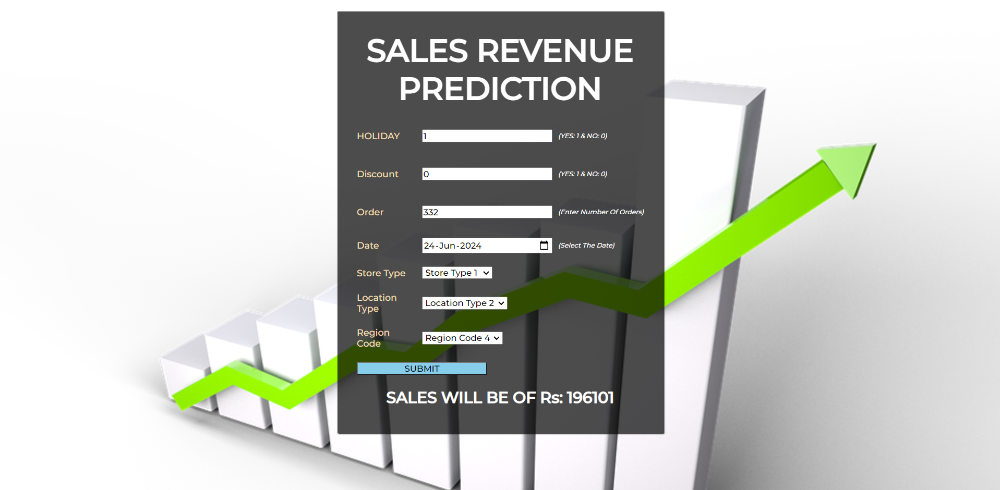

# Imarticus-Machine-Learning-Project-Sales-Price-Prediction

This is an end-to-end project where based on some of the important features such as Holiday, Discount, Order, Month, Day, Store_Type, Location_Type, Region_Code we can predict the amount of sales we can do.

### Problem Statement:

<b>Supplement Sales Prediction</b>

- Your Client WOMart is a leading nutrition and supplement retail chain that offers a comprehensive range of products for all your wellness and fitness needs.

- WOMart follows a multi-channel Distribution strategy with 350+ retail stores spread across 100+ cities.

- Effective forecasting for store sales gives essential insight into upcoming cash flow, meaning WOMart can more accurately plan the cashflow at the store level.

- Sales data for 18 months from 365 stores of WOMart is available along with information on Store Type, Location Type for each store, Region Code for every store, Discount provided by the store on every day, Number of Orders everyday etc.

- Your task is to predict the sales revenue based on suitable features.

# Web-App URL:
https://sales-prediction-icx.herokuapp.com/

# Project Type:
Regression

# Domain Targeted:
Marketing & Sales

# Technologies Used:
- Python
- Anaconda Jupyter Notebook
- PyCharm
- HTML/CSS
- HeroKu

# Application Interface:

