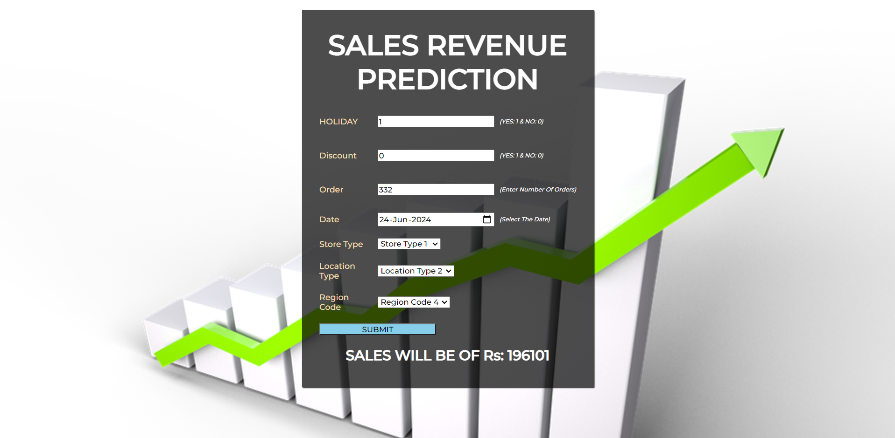

# Imarticus-Machine-Learning-Project-Sales-Price-Prediction

This is an end-to-end project where based on some of the important features such as Holiday, Discount, Order, Month, Day, Store_Type, Location_Type, Region_Code we can predict the amount of sales we can do.

# Web-App URL:
https://sales-prediction-icx.herokuapp.com/

# Project Type:
Regression

# Domain Targeted:
Marketing & Sales

# Technologies Used:
- Python
- Anaconda Jupyter Notebook
- PyCharm
- HTML/CSS
- HeroKu

# Application Interface:

